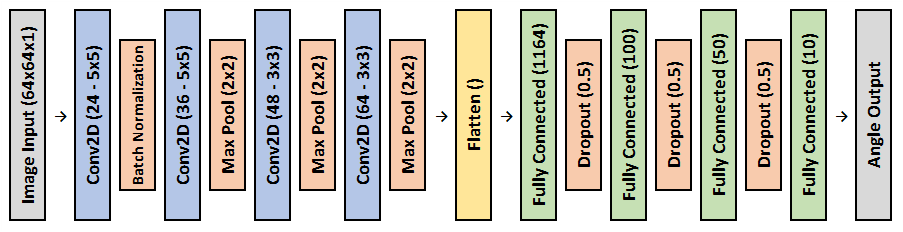
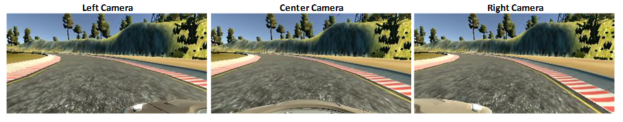

#Udacity Self-Driving Car Nanodegree - Behavioral Cloning

#####Douglas Wirtz
#####February 2nd, 2017

##Background

Behavioral cloning is an act of learning through imitation whose main purpose is to build a model of human behavior. In this project, behavioral cloning is applied to mimic the complex skill of driving a car. In order to achieve this task, first, data is collected via a simulator. As a human drives the car around the track, the simulator records the images of three camera angles (left, right, and center) and the steering angle at the time each image was taken. The simulator creates a labeled dataset of inputs (images) and outputs (steering angles) needed to train a convolutional neural network. After the network is trained, the model is then applied to the simulator, autonomously driving a car around the track.  

##Approach

The inspiration for my approach largely came from a paper Nvidia wrote about [End-to-End Deep Learning for Self-Driving Cars](https://devblogs.nvidia.com/parallelforall/deep-learning-self-driving-cars/) and [keras documentation](https://keras.io/). I wanted to develop a solution that was as close to a real scenario as possible. What I mean by that is I only collected data from cleaning driving. Then through multiple camera angles, image transformations, and image processing, I created the synthetic data needed to simulate recovery driving.

##Network Architecture

Inspiration for this network architecture originated from the Nvidia End-to-End Deep Learning paper. This network starts with inputting a 64x64x1 image into a convolutional layer comprised of 24-5x5 filters. That is followed by a batch normalization layer which normalizes the activations of the previous layer by maintaining the mean activation close to 0 and the activation standard deviation close to 1. That layer is followed by 3 more convolutional layers with filters of 36, 48, and 64 respectively. The kernal size of those layers are 5x5, 3x3, and 3x3 respectively. Each of those convolutional layers is followed by a max pooling layer with 2x2 filters. Max pooling will help against over-fitting the data as well as reducing the parameters and computational cost. Then the model gets flattened, followed by 4 fully connected layers with 1164, 100, 50, and 10 neurons respectively with L2 regularization. The L2 regularization applies penalties to the weight parameters during optimization. Inserted in the middle of the fully connected layers are dropout layers with a keep probability of 50%. Implementing dropout layers forces the model to develop redundancies as well as helping against over-fitting the data. Finally, the model outputs a steering angle. ReLU activations were used for this model to introduce non-linearity to my model. The model was compiled using the Adam Optimizer measuring the mean squared error ('mse') as the loss.

##Training

The data used in training was obtained by driving two clean laps in the simulator using a joystick. I drove the car at ~20 mph. I didn't collect any recovery data becuase it was my intention to truthful to a real scenario. I developed recovery data through image processing and other camera angles. Every frame records 3 images: left, center, and right. 

However, the steering angle recorded is that only of the center image. That being said, I included a +0.25 steering angle offset to every left camera image and a -0.25 steering angle offset to the right images. The offsets are intented to simulate a recovery angle to correct towards the middle of the lane.

Once the dataset was completely built, it was shuffled (to avoid ordering bias) and split into a 20% validation set. The data was trained using a fit generator. A fit generator works in parallel to the model and allows for only a single batch of data to be stored in memory at a given time. It enables the CPU to do real-time data augmentations on images while the GPU trains the model.

As a batch of data enters the fit generator, it goes through a series of augmentations that generates synthetic data. The great thing about performing augmentations is that you can train a model with relatively low amounts of data. Every time data goes through the model, even among multiple epochs, the random augmentations performed generates a seemingly unlimited amount of different combinations. The augmentations for my model are as follows:

**1. Mirror Data**

* Images in the dataset has a 50% chance to be fliped horizontally. This is intended to reduce the bias of taking a left turn vs. right turn.

**2. Translate Image**

* Images are translated by a random x and y movement. This simulates the car being at different positions on the road.

**3. Augment Brightness**

* Each image is augmented with a random brightness level to simulate different times of day and/or different weather patterns.

**4. Reduce Bias of Driving Straight**

* If the angle of an image is equal to 0.0, then that image/angle pairing has a 50% chance to be dropped. This is intended to reduce the bias of the model predicting 0.0.

**5. General Image Processing**

* **Crop:** The hood of the car and the sky are cropped out of the original image because those have no impact on the predictions.
* **Resize:** Each image is resized to 64x64x3 to reduce computational cost and time it takes to train.
* **Grayscale:** Each image is converted to grayscale to improve accuracy and reduce computational cost.
* **Normalize:** Every pixel in the image is normalized to a value between -1 and 1.

This model was initally trained with a learning rate of 0.0001 and a batch size of 128 for 10 epochs. After 10 epochs, the model was tested on the simulator. If it needed further optimization, the weights were loaded and trained 1 epoch at a time.

As the model is being tested on the simulator, the center image in every frame is processed using the 4 techniques under "General Image Processing" to predict the steering angle.

***
