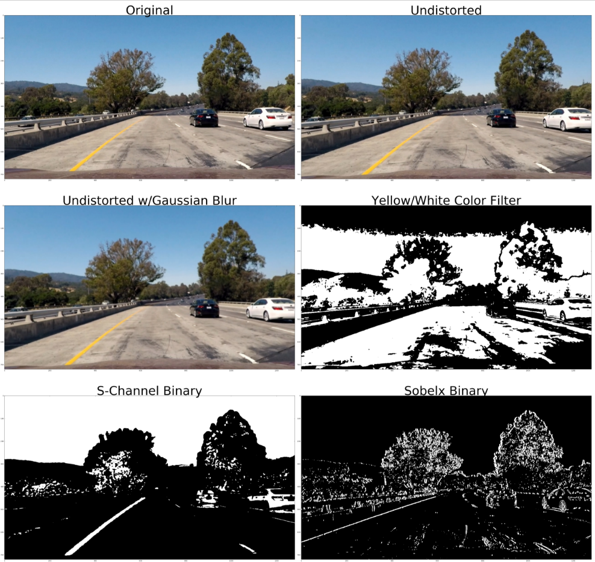

#Udacity Self-Driving Car Nanodegree - Adv. Lane Finding

#####Douglas Wirtz
#####February 13th, 2017

##Background

Computer vision is the science of gaining a high-level understanding of the world through digital images and videos. It is one of the many important approaches in successfully engineering a self-driving car. The images and videos used for this project were obtained using a front-facing camera on a moving car. The goal of this project is to use various computer vision techniques in a software pipeline to identify the lane boundaries on an image of a road. This is followed by an application of the pipeline on a series of images (i.e. video) to assess the robustness of the software.

##Approach

I decided on a basic step-wise approach for this project, completing each task by building on the previous ones. Outlined below are the series of steps I took to complete this project. To view a more in-depth detail of the code used, the steps are clearly numbered in the [P4_AdvancedLaneFinding markdown file](P4_AdvancedLaneFinding.md). 

**Advanced Lane Finding Project**

1. Import dependencies and functions
2. Compute the camera calibration matrix and distortion coefficients given a set of chessboard images
3. Apply a distortion correction to raw images
4. Use color transforms, gradients, etc., to create a thresholded binary image
5. Apply a perspective transform to rectify a binary image ("birds-eye view")
6. Detect lane pixels and fit to find the lane boundary
7. Determine the curvature of the lane and vehicle position with respect to center
8. Warp the detected lane boundaries back onto the original image
9. Output visual display of the lane boundaries, numerical estimation of lane curvature, and vehicle position
10. Run pipeline on project video

###1. Import dependencies and functions

Here I imported all the dependencies and funtions I used to complete this project. The idea here was to keep the IPython notebook organized by keeping the individual steps clean. This also proved to be beneficial because it allowed me to build the `pipeline()` funtion piece by piece. During experimentation, I built the function in the step it was used in, and I made changes as I saw fit. Once it was finalized, I moved it to the dependencies and functions code block.

###2. Compute the camera calibration matrix and distortion coefficients given a set of chessboard images

The absolute first step in this project must be camera calibration. This will allow you to correct for image distortion and accurately process each image to be representative of real world distances. 

In order to do this, I filled a list of object points, `objpoints = []`, which are 3D points in a real world space, and a list of image points, `imgpoints = []`, which are the corresponding 2D points in an image. I filled the lists using a combination of the   9x6-corner chessboard calibration images in the `/camera_cal` folder and the `cv2.findChessboardCorners()` function. If the corners were found in the image, the real world object points and corresponding image points were appended to their respective lists. While looping through the images, finding the chessboard corners, I used the `cv2.drawChessboardCorners()` function to draw the corners on the chessboard images. Here is an example:

Finally, I used the `cv2.calibrateCamera()` function in conjunction with `objpoints` and `imgpoints` to compute the calibration matrix, `mtx`, and the distortion coefficients, `dist`.

###3. Apply a distortion correction to raw images

Along with `mtx` and `dist` from the previous section, I used `cv2.undistort()` to undistort images. Once an image is corrected for distortion, it can then proceed to the meat of image processing. Below is an example of an undistorted calibration image as well as an example of a test image from the `/test_images` folder.

###4. Use color transforms, gradients, etc., to create a thresholded binary image

This is where a lot of the magic happens. Performing various transformations and gradient thresholdings on an undistorted image to create a binary image is what allows us to see only what we want to see. Below is a list of the transformations done on every image, how each one was computed, and why it is necessary for each transformation.

* **Undistortion:** Refer to steps 2-3 of this document for details on undistorting an image.
* **Gaussian Blur:** A Guassian blur transformation will reduce the noise in an image by averaging pixels, making the image more blurry. The idea behind this is to reduce the amount of unecessary features in the final transformation. To perform this, I used the undistorted image as an input to the `cv2.GaussianBlur()` function with a kernal size of 5.
* **Yellow and White Color Filter:** As I was experimenting my pipeline, it performed fairly well on the video with the exception of transitioning to and from shaded areas. When the video approached those points, the performance dropped. Adding this color filter to the combined binary image significantly increased the performance in those areas.
* **Applying the Sobel Operator:** The Sobel operator is similar to the `cv2.Canny()` function but allows us to apply edge detection to either the x or y direction. Because we know that the lane line are close to vertical, we will apply the Sobel operator to the undistorted image in the x direction, creating a binary output. This is done using `cv2.Sobel()`.
* **Magnitude of the Gradient:** With the result of a Sobel transformation, you can compute the magnitude of the gradient by setting thresholds to identify pixels within a certain gradient range. This transformation will allow the x-gradient to do a better job of picking up the vetical lane lines. The output from this is another binary image.
* **Direction of the Gradient:** Gradient direction is a big part of why `cv2.Canny()` edge is so great at picking up all edges in an image. With a result from a Sobel transformation, you can compute the direction of the gradient by setting a direction threshold. The direction of the gradient is computed by `arctan(sobely/sobelx)` and a binary output is created by setting pixels within the threshold to 1 while the other pixels to 0.
* **HLS Color Space:** When changing the undistorted image to grayscale, you lose some valuable color information, especially when changes in lighting occurs. Changing the HLS color space also helps when it becomes difficult to detect an edge (i.e. a yellow lane line in the bright sunlight). It turns out that the S_channel in the HLS color space is one of the most robust color spaces to use in a binary color filter. To create this binary filter, I converted the undistorted image to the HLS color space using `cv2.COLOR_RGB2HLS()` and then selected the S_channel by `s_channel = hls[:,:,2]`.
* **Combined Thresholded Binary Images:** After all the binary filters were created, aspects from each one were combined into a final binary image. The idea behind creating all of these filters is to develop a robust binary output, so that differences in lighting, time of day, and weather patterns will have less of an impact on the final combined binary output.
* **Apply a Crop Mask:** Since the camera is fixed on the center of the car, it's safe to assume a consistent area of interest when searching for lane lines. Using 4 defined points on the image, `cv2.fillPoly()`, and `cv2.bitwise_and()`, I applied a mask that removed almost everything from the surrounding lane lines. This will especially helps in step 6 when I detect for lane pixels in the warped binary image. specifically, this helped me remove the variable of the passing car in the project video. One of my first implementations periodically picked up the passing car and thought it was a lane line.

Below you can see each step performed using an image from the `/test_images` folder.

###5. Apply a perspective transform to rectify a binary image ("birds-eye view")

Using the final masked binary image, I chose 4 source (`src`) points in a trapezoidal fashion followed by 4 destination (`dst`) points that has the shape of a rectangle. I warped those points, interpolated linearly, using the functions `cv2.getPerspectiveTransform` and `cv2.warpPerspective`. Two very important variables are computed from this step. The first is the warp matrix (`M`) which is used to convert the image to the warped, 'birds-eye view'. The second is the inverse warp matrix (`Minv`) which will not be used in this step because it is used to convert the warped, polyfill mask back to the original dimensions. Continuing with the example in the previous step, below is a picture of the combined masked binary being warped into a 'birds-eye view' of the road.

###6. Detect lane pixels and fit to find the lane boundary

To detect the left and right lane lines, I took the bottom half the warped image in step 5, and summed up all of the y points for every x point. This is essentially a histogram showing the frequency of y values per x value. The left and right lane bases will be set to the highest peaks in the histogram because in a robust algorithm, those highest peaks will correspond to lane line pixels. From there, I set the number of search windows to 9, each with an equal height. I set the margin equal to 100, which sets the width of each window (peak base +/- margin). Lastly, I set the minimum threshold of amount of pixels required to recenter the window to 50 pixels. As the algorithm loops through each search window, it finds all indeces within in the specified range, and appends them to a list. If the window has more than the minimum of 50 nonzero pixels, the next window will be recentered on the mean of the current window. There is a check in place to see if the difference between the current window and the previous window is greater than 60 pixels. If it is greater, then the current window base is changed to the previous window. Once I concatenated the left and right indeces, I extracted the pixel positions and applied a polynomial fit using `np.polyfit()`. After obtaining the line fit, I generated points along the fit lines to plot a continuous line. Here is an example of a binary warped image with the left and right fit lines plotted. You can also see the 9 search windows outlined in green.

When applying the pipeline to a video, in the first frame, I used the histogram and window search to find the lane lines. However, in a video, you can use the previous fit lines to find the lanes in the next frame. To do this, I implemented global variables to serve as on/off switches that allow the pipeline to use the window search on the first frame, but then uses the previous fit lines to find the next. This allows for smoother transitions from frame to frame.

###7. Determine the curvature of the lane and vehicle position with respect to center

My functions to determine the curvature of the lane (`find_curvature()`) and vehicle postion (`find_car_position()`) are embedded in my function to fit the lane lines (`fit_lines()`) because I use components of the function that I didn't want to carry forward in my pipeline. The components, `leftx`, `rightx`, and `ploty` needed to be adjusted to real world space by multiplying the components by the meters/pixel ratio in both the x and y dimension. The x dimension is 3.7 meters for every 700 pixels, and the y dimension is 30 meters for every 720 pixels. Instead of carrying the components forward, I computed them inside the `fit_lines()` function and carried the results forward. In the final step of the pipeline, I used `cv2.putText()` to paste the curvatures of the left and right lane lines as well as the vehicle position relative to center on the final image. In reference to vehicle posistion, the center of the lane is equal to 0. Negative values mean that the vehicle is left of center whereas positive values mean that the vehicle is right of center.

For this test image example, the curvature of the left lane is 1203.32m and right is 4159.75m. The vehicle position is 0.153m to the right of center.

###8. Warp the detected lane boundaries back onto the original image

Now that I've determined the polynomial fit for both the left and right lane lines, I used `cv2.follPoly()` to change all points between the left and right lines green. Using `cv2.warpPerspective()` and the inverse warp matrix from step 5 (`Minv`), I warped the polyfill mask back to the original dimensions. Finally, using `cv2.addWeighted()`, I applied the new warped mask to the undistorted image to create the final product seen below.

###9. Output visual display of the lane boundaries, numerical estimation of lane curvature, and vehicle position

Here I ran every image in the `/test_image` folder through my pipeline to display the lane boundaries, numerical estimation of the lane curvature, and vehicle position. All of these images below can be found in the `/output_images` folder.

###10. Run pipeline on project video

Completing this project in steps allowed me to build a very straight-forward pipeline. Please direct yourself to the video in this repository entitled "new_project_video". Using `moviepy.editor`, I ran every frame of this video through my pipeline software to detect the lane line boundaries on a road.

###Discussion

On the first couple of implementations of my pipeline, I remember two distinct problems I faced. The first of which was an issue occuring when the car enters/leaves shaded areas. The lane detection worked fairly well up to those points, and then, in my opinion, failed miserably. The detection would become very wobbly and flicker in and out. After some research and adjustment of some thresholds, I implemented a yellow/white color filter to the binary output. This allows the pipeline adjust better to those sudden changes in lighting. 

The second problem I remember having was the passing car on the right. As the car was passing, my early implementation picked up the car as a lane line, essentially making my lane twice as big. To fix this issue, I implemented an area-of-interest mask to my binary output that zeroed all pixels outside of the area. This issue was immediately resolved in my next implementation. I did make other changes since this addition, so it's possible I might have been able to solve this problem using other means.

My final implementation works fairly well, but there is always a way to make it more robust. In a future implementation, I would like to work on making the right lane (or dashed lane lines in general) perform better. Another improvement I would like to make is make the curvature of each lane line more consistent with its counterpart.

This current implementation/pipeline will likely fail on dirt roads, or on roads with harsh conditions (i.e. weather or anything that would make it difficult to see the lane lines). Another thing to consider is that this pipeline was run on a video of a well-kept highway. Over time, road integrity will diminish. If the road integrity diminishes to a point where we couldn't see the line, this implementation will likely fail. So to add to the future goals of this pipeline, I would implement an algorithm, maybe even a deep neural network, to predict what the lane line would look like given a very little amount of information.

***
