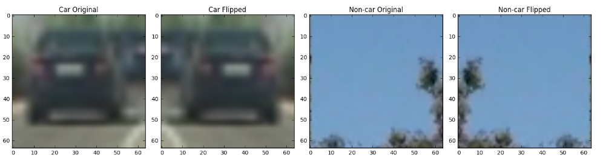
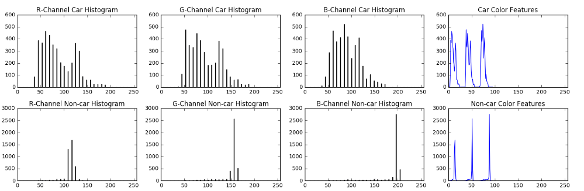
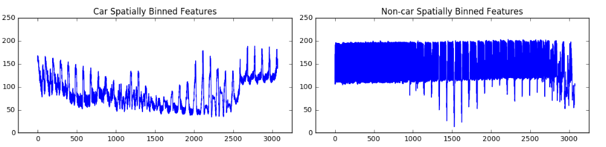
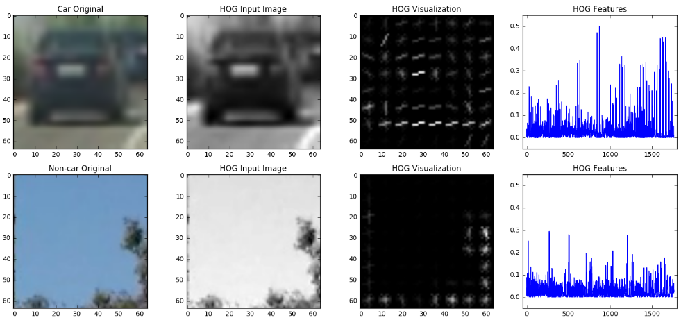
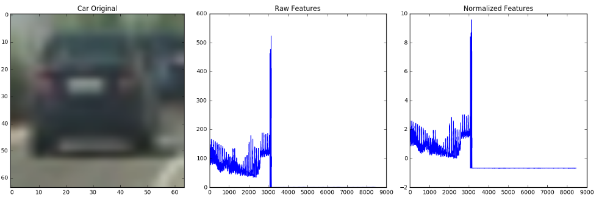
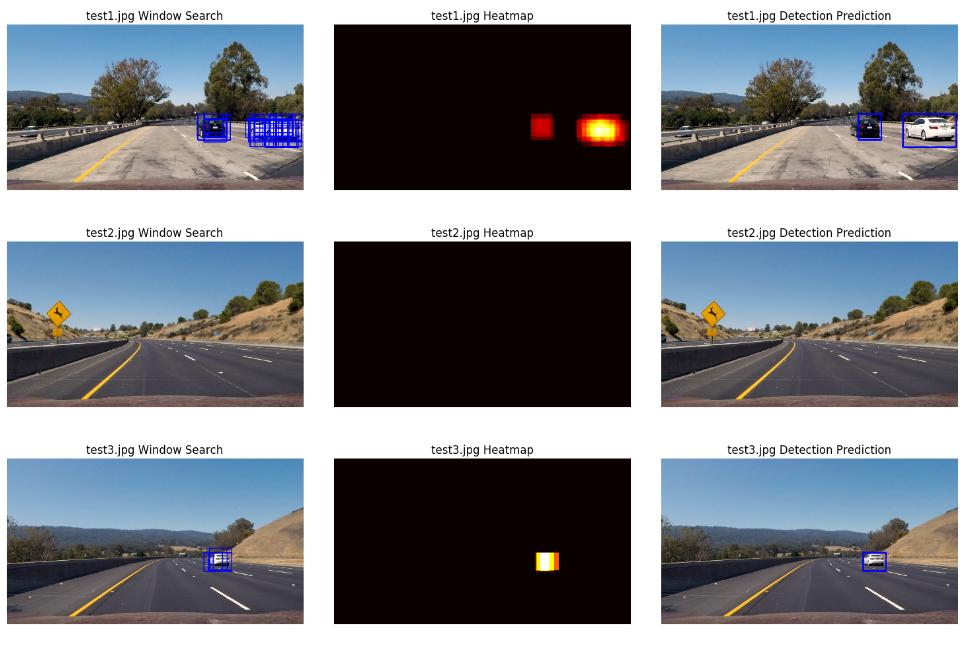
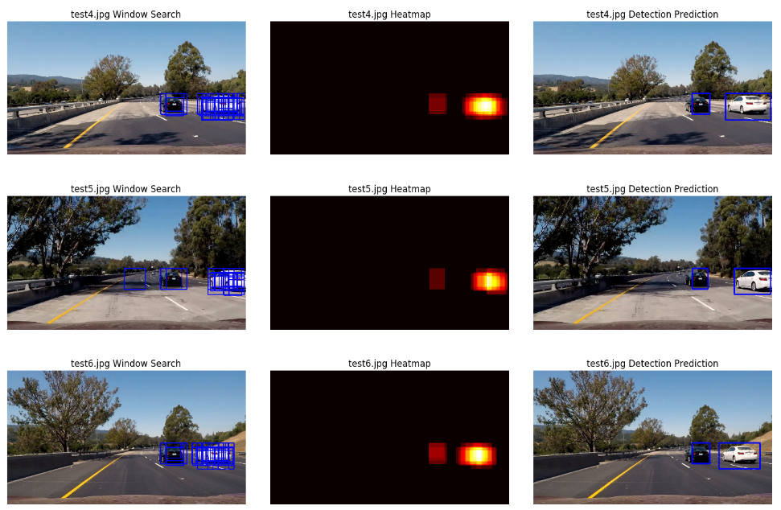

# Udacity Self-Driving Car Nanodegree - Vehicle Detection

##### Douglas Wirtz
##### February 27th, 2017

## Background

Computer vision is the science of gaining a high-level understanding of the world through digital images and videos. It can be used along with a well-trained classifier to develop a powerful approach to engineer a self-driving car. The test images and videos used for this project were obtained using a front-facing camera on a moving car. The [car](https://s3.amazonaws.com/udacity-sdc/Vehicle_Tracking/vehicles_smallset.zip) and [non-car](https://s3.amazonaws.com/udacity-sdc/Vehicle_Tracking/non-vehicles_smallset.zip) datasets used for training the classifier were provided by Udacity. The goal of this project is to use the car and non-car datasets to train a classifier to detect vehicles on a road. Then using various computer vision techniques and the trained model, I built a software pipeline to detect and track the vehicles in both single images and videos.

## Approach

Similar to P4_AdvancedLaneLines, I approached this project by breaking the image processing video pipeline into its components. This allowed me to explore/visualize the data, experiment with ideas, and tune a pipeline one step at a time. Outlined below are the series of steps I took to complete this project. To view a more in-depth detail of the code used, the steps are clearly numbered in **P5_VehicleDetection.ipynb**. 

**Vehicle Detection Project**

1. Import dependencies and functions
2. Read in dataset images and process for visualization
3. Explore image features
4. Train a classifier
5. Apply classifier to predict vehicle detection in test images
6. Run classifier pipeline on project video

### 1. Import dependencies and functions

Here I imported all the dependencies and funtions I used to complete this project. The idea here was to keep the IPython notebook organized by keeping the individual steps clean. This also proved to be beneficial because it allowed me to build the `pipeline()` funtion piece by piece. During experimentation, I built the function in the step it was used in, and I made changes as I saw fit. Once it was finalized, I moved it to the dependencies and functions code block.

### 2. Read in dataset images and process for visualization

To read in the datasets, I used the `glob` module to generate a list of file paths. Then with the defined function `read_images()`, I read in each image using `mpimg.imread()`. After the images were read in, I checked the number in each dataset and found that the number of cars and non-cars were relatively similar, so I didn't take any action to even them out. I then doubled the size of the datasets with my function `flip_append()`, which essentially loops through every image, flips it, and appends the original along with the flipped into a new list. The final action I took with the classification images was to fix the scaling of the images. Using `mpimg.imread()` reads in .PNG images scaled 0 to 1. I fixed this with my `fix_scale()` function which loops through all of the images in a list and multiplies each image by 255. Here is an example of a car and non-car image with its flipped counterpart.



### 3. Explore image features

In this step, I used the original car and non-car examples from above and explored the different features. First up was exploring the color channel features. Using the function `clolor_hist()` with `vis_hist=True`, it took in an RGB images and created histograms of each color channel. In addition, the function returns a list of histogram features which can be visualize with a plot. With this visualization alone, you can tell images of cars have much more color differential when compared to an image of a non-car.



Next up I looked at spatially binned features of an RGB version of the car and non-car example (`bin_spatial()`). Using a bin size of 32x32 and `cv2.resize().ravel()`, I created the feature vectors seen in the plots below. Here you can see a drastic difference between a car and non-car image.



Finally, I explored the HOG features of the example images from above. Because the `hog()` function takes in either a single color channel or grayscale image, for the purpose of this visualization, I converted the image to grayscale. I chose an orientation of 9 because I didn't want to split the gradient information up too much (> the typical value of 12) or too little (< the typical value of 6). Because I was classifying on 64x64 images, I wanted to keep my pix_per_cell and cell_per_block evenly divisible. So for that, I chose a pix_per_cell of 8 and cell_per_block of 2. When I trained my classifier and ran predictions on the test images/video, I kept all of these HOG parameters the same with the only exception being the color space. I changed the color space from grayscale to an RGB color space. I chose the RGB color space because it was the color space in my first iteration, and it showed some really promising results. Instead of trying a different color space immediately, I decided to improve upon what I had already put in place. With the visualization below, you can tell that the non-car HOG visualization is largely empty becuase there wasn't much change from pixel to pixel whereas the car HOG visualization showed the opposite.



If you want to use all the features when training your classifier, it's important that you concatenate all of the feature vectors and scale them appropiately so that one set of features doesn't have a bias over another. Once you concatenate the features, you can scale them using `StandardScaler().fit()`. Once you fit the concatenated feature vector, you transform it into a scaled feature vector. Below you can see the spatial, color, and HOG features extracted from the original car image. They have been concatenated and plotted along with the scaled or normalized feature vector.



### 4. Train a classifier

To train my SVM classifier, I used the `extract_features()` function to extract all of the features from the car and non-car datasets prepared in step 2. I extracted the features using the following parameters:
```
# Train a SVM classifier
color_space = 'RGB' # Can be RGB, HSV, LUV, HLS, YUV, YCrCb
orient = 9  # HOG orientations
pix_per_cell = 8 # HOG pixels per cell
cell_per_block = 2 # HOG cells per block
hog_channel = 'ALL' # Can be 0, 1, 2, or "ALL"
spatial_size = (32, 32) # Spatial binning dimensions
hist_bins = 32    # Number of histogram bins
spatial_feat = True # Spatial features on or off
hist_feat = True # Histogram features on or off
hog_feat = True # HOG features on or off
```
Once I extracted the features, I vertically stacked the car and non-car feature vectors, scaled them using `StandardScaler().fit()`, assigned labels (1 == car and 0 == non-car), shuffled x and y using `shuffle()`, and split the training into a 20% testing set using `train_test_split()`. From there I used a support vector classifier (SVC) to train the classifier and got the following results:
```
223.47 Seconds to extract image features...
Using: 9 orientations 8 pixels per cell and 2 cells per block
Feature vector length: 8460
105.96 Seconds to train SVC...
Test Accuracy of SVC =  0.9879
My SVC predicts:  [ 0.  1.  0.  0.  0.  0.  1.  1.  1.  0.]
For these 10 labels:  [ 0.  1.  0.  0.  0.  0.  1.  1.  1.  0.]
0.02 Seconds to predict 10 labels with SVC
```

### 5. Apply classifier to predict vehicle detection in test images

In order to apply the classifier to predict vehicle detection in the test images, you must define your slide windows and at what scale. because we don't want to predict cars in the sky, we can immediately focus our efforts to predict cars from the horizon (about middle of the image) to the hood of the car. When setting my y_start_stop variable, I took into account the scale at which I was running the slide window. As the scale gets smaller, the y_start_stop window will get narrower. The reason for this is the fact that cars will appear smaller as they get closer to the horizon. 

It's beneficial to set specific slide windows based on the scale is because of computing power and reduce false positives. The bigger the slide window region of interest, the longer it will take to process each image (or each frame in a video). So it's better to limit the large region of interest to the larger xy_window scale. On the other side of things, it can help to reduce the number of false positives. For example, imagine you're using a small scale xy_window in an area close to the hood of the car. That area is clearly meant for a larger scale xy_window. Using a small scale xy_window in that area can increase the risk of something on the ground being classified as a false positive, causing the car to potentially make a detrimental corrective action. So in short, adjust the region of interest appropiately based on the xy_window scale.

For my implementation, I searched the windows at 3 different scales, with a 75% overlap, and drew boxes around the positively classified. From there I applied heat to the zones where boxes were; higher the heat, the more boxes that overlapped. Then using `apply_threshold()`, I applied a threshold of 1 which removes boxes that didn't have any overlap through the 3 different scales. These likely will identify as your false positives.

After applying the thresholding, I labeled the heatmap using `label()` which identifies how many cars there are and drew the label boxes using `draw_labeled_bboxes()`. The draw function draws a rectangle using the min and max of the labels resulting in one clean box per identified car.

In efforts to save on computing time and reduce false positives, I restricted my biggest xy_window scale to an x_start_stop of everything right of the yellow line. My two subsequent smaller xy_window scales were stricted to an x_start_stop of everything right of the dashed line. With my current heatmap thresholding, this will reduce/eliminate false positives directly in front of the car due to things such as shadows, while still picking up positive results if a hypothetical car had been in front at an appropriate scale (i.e. close enough). My main concern was to reduce false positives directly in front or directly to the side of the car because those false positive results could have the greatest detrimental impact on a corrective action.





### 6. Run classifier pipeline on project video

Running the detection process on the video is similar to the process described above with a couple of additions. In my `pipeline()` function, I used global variables to grab the previous frame's heatmap as well as setting the previous variable, `set_prev`, equal to 0/1 (False/True). In the first frame of the video, the pipeline runs the process exactly like in step 5. However, from the second frame to the end, it uses the previous frame's heatmap multiplied by the smoothing factor and adds it to the current heatmap multiplied by (1 - the smoothing factor) (i.e. `heatmap * (1 - smoothing_factor) + heatmap_prev * smoothing_factor`). This will help with smoothing the vehicle tracking from frame to frame. After the heatmaps have been proportionally added, it goes through another threshold application to remove any other potential false positives.

### Discussion

This implementation works for this project fairly well, but there are several things I'd like to improve upon in future implementations. I had trouble getting a final product that I'd be confortable submitting. First and foremost, I didn't want any false positive directly in front of the car. To me, that is the most dangerous type of false positive that could occur. In getting the false positives to a suitable level, I suffered on some of the vehicle tracking. This is shown toward the end of the video when the algorithm loses track of the black car it gets further away. That would be something I'd like to improve in the future. It's very possible that could be fixed via other future implementations.

In the future, I'd like to add more window xy_window scalings. In mine, I only used 3, but if computing time wasn't a factor, I'd implement a gradual decreasing xy_window scale with the x_start_stop and y_start_stop decreasing in an appropiate fashion. This would allow the classifier to predict at all scales. Now of course this would likely increase the amount of false positives, but having more scales would allow me to increse the removal threshold because there would be more overlapping boxes. Assuming that the false positives would still only have a low number of overlapping boxes, having more xy_window scales would dramatically increase the difference between overlapping boxes of positives vs. overlapping boxes of false positives.

I feel like this pipeline will fail if it was dark outside becuase the black car would likely blend in with the surrounding better if it was dark outside. Also, this pipeline will likely fail in a situation with a lot of light changing. For example, look at step 5, 'test5.jpg Window Search' image. The image shows a false positive as the car is entering an area covered by shade and light. If that type of lighting carried on for a while, the pipeline might predict enough false positives that go beyond the removal threshold. 

***
